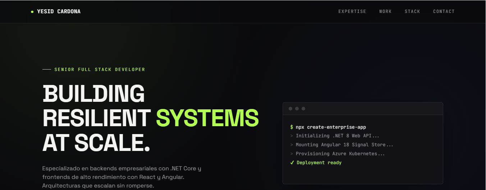

# Yesid Cardona — Full Stack Developer Portfolio

Personal portfolio website built with Angular 22, showcasing my experience, technical skills, and selected projects as a Full Stack Developer.



## 👨‍💻 About Me

I'm a Full Stack Developer with over 10 years of experience building web applications and enterprise solutions.

My main areas of expertise include:

- .NET / .NET Core
- Angular
- React
- TypeScript
- REST APIs
- SQL Server
- Azure
- Docker

## 🚀 Tech Stack

| Technology | Usage |
|---|---|
| Angular | Frontend |
| TypeScript | Programming language |
| SCSS | Styling |
| .NET | Backend |
| REST APIs | API integration |
| SQL Server | Database |
| Azure | Cloud |
| Docker | Containerization |


## 🏗️ Architecture of this landing

The frontend is built using Angular's standalone component architecture.

```text
src/
├── app/
│   ├── features/
│   ├── layout/
│   ├── app.ts
│   └── app.routes.ts
│
├── assets/
└── styles.scss
```

## Local environment

The project uses a local environment file for development credentials.

After cloning the repository, create the local environment file by copying:

`src/environments/environment.local.example.ts`

to:

`src/environments/environment.local.ts`

Then replace the placeholder values in `environment.local.ts` with your own credentials.

> `environment.local.ts` is excluded from Git and must not be committed to the repository.

Once configured, start the application with:

```bash
npm start